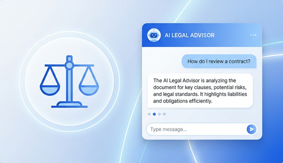

<div align="center">
  

# ⚖️ AI Legal Advisor

### Professional AI-Powered Legal Assistance at Your Fingertips

  [](https://ai-legal-advisor-chatbot.vercel.app/)
  [](https://reactjs.org/)
  [](https://www.typescriptlang.org/)
  [](https://vitejs.dev/)
  [](https://tailwindcss.com/)
  [](https://ai.google.dev/)

  ---
</div>

## 🌟 Overview

**AI Legal Advisor** is a sophisticated, AI-driven platform designed to provide accessible, professional, and accurate legal information. Built with modern web technologies and powered by the cutting-edge **Gemini 2.0 Flash** model, it serves as a first-line resource for understanding laws, regulations, and legal procedures.

---

## 🚀 Live Website

The project is fully deployed and accessible online. Experience the AI Legal Advisor in action:

[](https://ai-legal-advisor-chatbot.vercel.app/)

---

## 🚀 Key Features

- **⚖️ Expert Legal Guidance**: Knowledgeable assistance across various legal jurisdictions and topics.
- **🔒 Secure & Private**: Designed with privacy in mind, ensuring your inquiries remain confidential.
- **⚡ Real-time Responses**: Blazing fast AI responses powered by Google's Gemini API.
- **📱 Responsive Design**: A premium, minimalist UI that works flawlessly on desktop and mobile devices.
- **🛡️ Safety First**: Robust system prompts to ensure the AI stays within the legal scope and maintains a professional tone.

---

## 🛠️ Tech Stack

- **Frontend**: [React](https://reactjs.org/) with [TypeScript](https://www.typescriptlang.org/)
- **Styling**: [Tailwind CSS](https://tailwindcss.com/) & [Shadcn UI](https://ui.shadcn.com/)
- **AI Engine**: [Google Gemini 2.0 Flash](https://ai.google.dev/)
- **Routing**: [React Router](https://reactrouter.com/)
- **Icons**: [Lucide React](https://lucide.dev/)
- **Build Tool**: [Vite](https://vitejs.dev/)
- **Deployment**: [Vercel](https://vercel.com/)

---

## 📦 Getting Started

### Prerequisites

- Node.js (v18 or higher)
- npm or bun
- A Google Gemini API Key

### Installation

1. **Clone the repository**:

   ```bash
   git clone https://github.com/ajaygangwar945/Legal-Ai-Scribe.git
   cd AI-Legal-Advisor
   ```

2. **Install dependencies**:

   ```bash
   npm install
   # or
   bun install
   ```

3. **Set up environment variables**:
   Create a `.env` file in the root directory and add your API key:

   ```env
   VITE_GEMINI_API_KEY=your_gemini_api_key_here
   ```

4. **Run the development server**:

   ```bash
   npm run dev
   ```

---

## 🌐 Deployment

The project is optimized for deployment on **Vercel**. Connect your GitHub repository to Vercel, add the necessary environment variables, and it will be live in minutes.

---

<div align="center">
  Built with ❤️ by Ajay Gangwar
</div>
